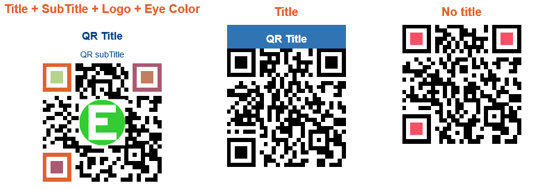

# EasyQRCodeJS

EasyQRCodeJS 是一个基于 [QRCodeJS](https://github.com/davidshimjs/qrcodejs "QRCodeJS") 的跨浏览器的纯 JavaScript QRCode 生成库。并支持二维码图片标题，副标题生成，Logo 图片生成。


EasyQRCodeJS is a Cross-Browser pure JavaScript QRCode generation library based on [QRCodeJS](https://github.com/davidshimjs/qrcodejs "QRCodeJS"). And support two-dimensional code picture title, subtitle generation, Logo image generation.


## Feature/特点

- **中文**

	- 跨浏览器，支持基于 HTML5 Canvas 和 table 的二维码生成。
	
	- 支持为二维码生成设置标题，副标题
	
	- 支持为二维码生成添加 Logo 图片
	
	- 支持背景透明的 PNG 图片
	
	- 不依赖任何第三方


- **English**

	- Cross-Browser that supports HTML5 Canvas and table.
	
	- Support for setting the title and subtitle 
	
	- Supports adding Logo images 
	
	- Support for transparent PNG images
	
	- Has no dependencies.

## Demo/示例



## Installation/安装

- Download install/下载安装

	```HTML
	<script src="dist/easy.qrcode.min.js" type="text/javascript" charset="utf-8"></script>
	
	```

- Npm install/Npm 安装

	```BASH
	npm install easyqrcodejs
	```


## Basic Usages
```HTML
<div id="qrcode"></div>
<script type="text/javascript">
	new QRCode(document.getElementById("qrcode"), "https://github.com/ushelp/EasyQRCodeJS");
</script>
```

or with some options

```JS
<div id="qrcode"></div>
<script type="text/javascript">
	var qrcode = new QRCode(document.getElementById("qrcode"), {
		text: "https://github.com/ushelp/EasyQRCodeJS",
		width: 256,
		height: 256,
		colorDark : "#000000",
		colorLight : "#ffffff",
		correctLevel : QRCode.CorrectLevel.H,
		
		// ==== Title
		title: 'QR Title', // content 
		titleFont: "bold 18px Arial", //font. default is "bold 16px Arial"
		titleColor: "#004284", // color. default is "#000"
		titleBgColor: "#fff", // background color. default is "#fff"
		titleHeight: 70, // height, including subTitle. default is 50
		titleTop: 25, // draws y coordinates. default is 30
		
		// ==== SubTitle
		subTitle: 'QR subTitle', // content
		subTitleFont: "14px Arial", // font. default is "14px Arial"
		subTitleColor: "#004284", // color. default is "gray"
		subTitleTop: 40, // draws y coordinates. default is 50
		
		// ==== Logo
		logo:"../demo/logo.png", // Relative address, relative to `easy.qrcode.min.js`
	//	logo:"http://127.0.0.1:8020/easy-qrcodejs/demo/logo.png", 
	//	logoWidth:80, // widht. default is automatic width
	//	logoHeight:80 // height. default is automatic height
	//	logoBgColor:'#fffff', // Logo backgroud color, Invalid when `logBgTransparent` is true; default is '#ffffff'
    //  logoBgTransparent:false, // Use transparent image, default is false
					
	});
</script>
```

and you can use some methods

```JS
qrcode.clear(); // clear the code.
qrcode.makeCode("https://github.com/ushelp/EasyQRCodeJS"); // make another code.
```

## Browser Compatibility
IE6~10, Chrome, Firefox, Safari, Opera, Mobile Safari, Android, Windows Mobile, ETC.

## License
MIT License

## End

Email：<inthinkcolor@gmail.com>

[http://www.easyproject.cn](http://www.easyproject.cn "EasyProject Home")


**支付宝钱包扫一扫捐助：**

我们相信，每个人的点滴贡献，都将是推动产生更多、更好免费开源产品的一大步。

**感谢慷慨捐助，以支持服务器运行和鼓励更多社区成员。**

</img>


We believe that the contribution of each bit by bit, will be driven to produce more and better free and open source products a big step.

**Thank you donation to support the server running and encourage more community members.**

[](https://www.paypal.me/easyproject/10 "Make payments with PayPal - it's fast, free and secure!")

