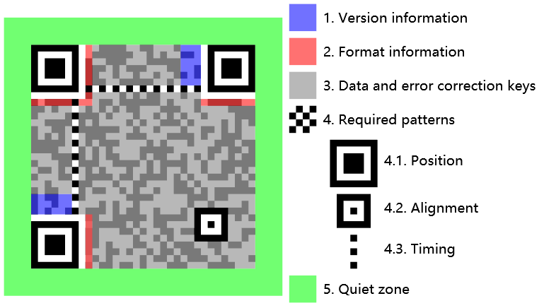
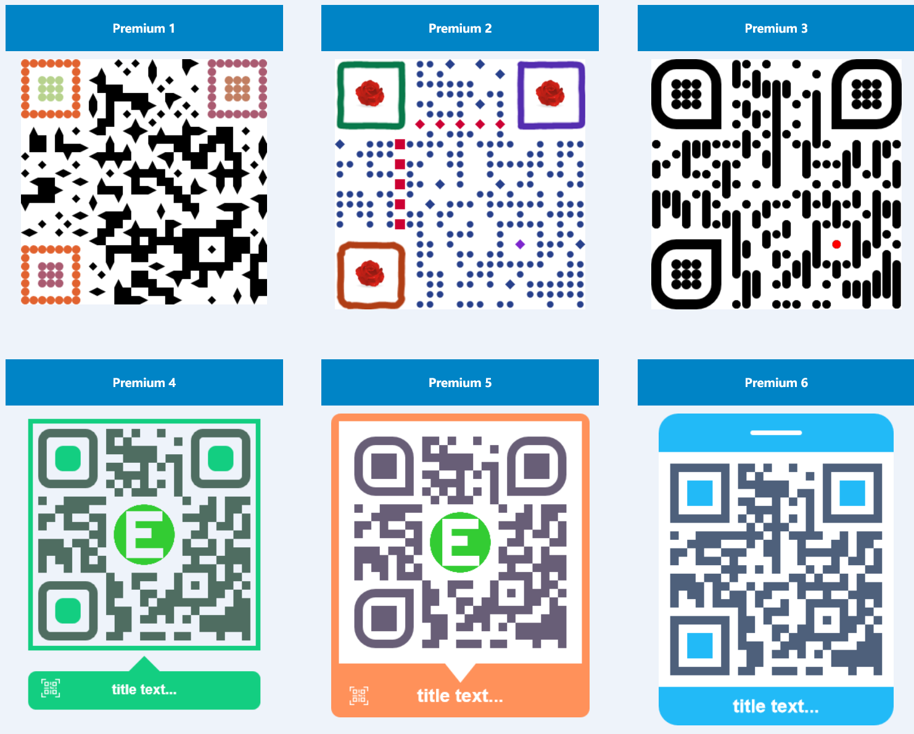

# EasyQRCodeJS

EasyQRCodeJS is a feature-rich cross-browser pure JavaScript QRCode generation library. Support Canvas, SVG and Table drawing methods. Support Dot style, Logo, Background image, Colorful, Title etc. settings. Support Angular, Vue.js, React, Next.js, Svelte framework. Support binary(hex) data mode.(Running with DOM on client side)

EasyQRCodeJS 是一个功能丰富的跨浏览器的纯 JavaScript QRCode 生成库。支持 Canvas, SVG, Table 等绘制方式。支持 JavaScript 模块化加载。支持点状风格，Logo，背景图片，规则色彩控制，标题等设置。支持 Angular, Vue.js, React, Next.js, Svelte 等框架。支持二进制数据模式。(基于客户端 DOM 运行)


## Table of contents

- [EasyQRCodeJS](#easyqrcodejs)
  - [Table of contents](#table-of-contents)
  - [Choose what you need](#choose-what-you-need)
  - [Feature](#feature)
  - [Try It!](#try-it)
  - [Demo preview](#demo-preview)
  - [QR Code Structure](#qr-code-structure)
  - [Installation](#installation)
  - [Load](#load)
  - [Basic Usages](#basic-usages)
  - [QRCode API](#qrcode-api)
    - [Object](#object)
    - [Options](#options)
    - [Method](#method)
  - [Angular Support](#angular-support)
  - [Vue.js Support](#vuejs-support)
  - [React Support](#react-support)
  - [Next.js Support](#nextjs-support)
  - [Svelte Support](#svelte-support)
  - [FQA](#fqa)
    - [Q1. Tainted canvases may not be exported.](#q1-tainted-canvases-may-not-be-exported)
  - [Browser Compatibility](#browser-compatibility)
  - [License](#license)
  - [EasyQRCodeJS-Premium](#easyqrcodejs-premium)
  - [End](#end)


## Choose what you need

| Project | Support |
| --- | --- |
| [EasyQRCodeJS](https://github.com/ushelp/EasyQRCodeJS) | **Running with DOM on CLIENT-SIDE .** Browser(IE6+, Chrome, Firefox, Safari, Opera, Mobile Safari, Android, Windows Mobile, ETC.), Electron, NW.js, ETC.  |
| [EasyQRCodeJS-NodeJS](https://github.com/ushelp/EasyQRCodeJS-NodeJS) | **Running without DOM on SERVER-SIDE**. Save image to file(PNG/JPEG/SVG) or get data url text.  NodeJS, Electron, NW.js, ETC.|
| [EasyQRCode-React-Native](https://github.com/ushelp/EasyQRCode-React-Native) | **A QRCode generator for React Native**. Generate QRCode image or get base64 data url text.|


## Feature

- **English**

    - Cross-browser support for QR code generation based on HTML5 Canvas, SVG and Table

    - Required Patterns that support dot style
 
    - Support for Quiet Zone settings
	
    - Support custom Position Pattern inner fill and outer border color

    - Support custom Alignment Pattern inner fill and outer border color

    - Support custom Timing Patterns vertical, horizontal color

    - Support Logo images (including transparent PNG images)

    - Support Background Image

    - Support for title, subtitle settings

    - Has no dependencies

    - Support AMD, CMD, CommonJS/Node.js JavaScript modules

    - Angular, Vue.js, React, Next.js, Svelte Support

    - Support binary(hex) data mode
    
    - Support TypeScript
    
- **中文**

    - 跨浏览器，支持基于 HTML5 Canvas, SVG 和 Table 的二维码生成

    - 支持点形风格的 Required Patterns

    - 支持 Quiet Zone 设置
	
    - 支持自定义 Position Pattern 内填充和外边框颜色
	
    - 支持自定义 Alignment Pattern 内填充和外边框颜色

    - 支持自定义 Timing Patterns 垂直，水平颜色

    - 支持 Logo 图片（包括背景透明的 PNG 图片）

    - 支持 Background Image 背景图片

    - 支持标题，副标题设置
	
    - 不依赖任何第三方
	
    - 支持 AMD，CMD, CommonJS/Node.js JavaScript 模块加载规范

    - Angular, Vue.js, React, NEXT.js, Svelte 支持

    - 二进制数据模式支持

    - TypeScript 支持

## Try It!

[Try It!](http://www.easyproject.cn/easyqrcodejs/tryit.html "EasyQRCodeJS Try It!")

## Demo preview


## QR Code Structure




## Installation

- Download install

    [https://github.com/ushelp/EasyQRCodeJS](https://github.com/ushelp/EasyQRCodeJS)

- Npm install

	```BASH
	npm install easyqrcodejs
	```

## Load

- Script load

	```HTML
	<script src="<PATH>/easy.qrcode.min.js" type="text/javascript" charset="utf-8"></script>
	
	```
    
- AMD load

	```JS
	require.config({
		paths: {
			QRCode: "<PATH>/easy.qrcode.min"
		}
	});
	
	require(["QRCode"], function(QRCode){
		
		// Your code...
		
	});
	```

- Node.js load(For Example, Use in [Electron](http://electronjs.org/ 'Electron'))

	```JS
	const QRCode = require('<PATH>/easyqrcodejs');
	
	// Your code...
	```
	

## Basic Usages
```HTML
<div id="qrcode"></div>

<script type="text/javascript">
	// Options
	var options = {
		text: "https://github.com/ushelp/EasyQRCodeJS"
	};
	
	// Create QRCode Object
	new QRCode(document.getElementById("qrcode"), options);
</script>
```

	
## QRCode API

### Object

```JS
var qrcode = new QRCode(DOM_object, options_object);
```


### Options

```JS
 var options_object = {
    // ====== Basic
    text: "https://github.com/ushelp/EasyQRCodeJS",
    width: 256,
    height: 256,
    colorDark : "#000000",
    colorLight : "#ffffff",
    correctLevel : QRCode.CorrectLevel.H, // L, M, Q, H
    
    // ====== dotScale
    /*
    dotScale: 1, // For body block, must be greater than 0, less than or equal to 1. default is 1
    
    dotScaleTiming: 1, // Dafault for timing block , must be greater than 0, less than or equal to 1. default is 1
    dotScaleTiming_H: undefined, // For horizontal timing block, must be greater than 0, less than or equal to 1. default is 1
    dotScaleTiming_V: undefined, // For vertical timing block, must be greater than 0, less than or equal to 1. default is 1
    
    dotScaleA: 1, // Dafault for alignment block, must be greater than 0, less than or equal to 1. default is 1
    dotScaleAO: undefined, // For alignment outer block, must be greater than 0, less than or equal to 1. default is 1
    dotScaleAI: undefined, // For alignment inner block, must be greater than 0, less than or equal to 1. default is 1
    */
   
    // ====== Quiet Zone
    /*
    quietZone: 0,
    quietZoneColor: "rgba(0,0,0,0)",
    */

    // ====== Logo
    /*
    logo: "../demo/logo.png", // Relative address, relative to `easy.qrcode.min.js`
    logo: "http://127.0.0.1:8020/easy-qrcodejs/demo/logo.png", 
    logoWidth: 80, // fixed logo width. default is `width/3.5`
    logoHeight: 80, // fixed logo height. default is `heigth/3.5`
    logoMaxWidth: undefined, // Maximum logo width. if set will ignore `logoWidth` value
    logoMaxHeight: undefined, // Maximum logo height. if set will ignore `logoHeight` value
    logoBackgroundColor: '#fffff', // Logo backgroud color, Invalid when `logBgTransparent` is true; default is '#ffffff'
    logoBackgroundTransparent: false, // Whether use transparent image, default is false
    */

    // ====== Backgroud Image
    /*
    backgroundImage: '', // Background Image
    backgroundImageAlpha: 1, // Background image transparency, value between 0 and 1. default is 1. 
    autoColor: false, // Automatic color adjustment(for data block)
    autoColorDark: "rgba(0, 0, 0, .6)", // Automatic color: dark CSS color
    autoColorLight: "rgba(255, 255, 255, .7)", // Automatic color: light CSS color
    */
    
    // ====== Colorful
    // === Posotion Pattern(Eye) Color
    /*
    PO: '#e1622f', // Global Posotion Outer color. if not set, the defaut is `colorDark`
    PI: '#aa5b71', // Global Posotion Inner color. if not set, the defaut is `colorDark`
    PO_TL:'', // Posotion Outer color - Top Left 
    PI_TL:'', // Posotion Inner color - Top Left 
    PO_TR:'', // Posotion Outer color - Top Right 
    PI_TR:'', // Posotion Inner color - Top Right 
    PO_BL:'', // Posotion Outer color - Bottom Left 
    PI_BL:'', // Posotion Inner color - Bottom Left 
    */
    // === Alignment Color
    /*
    AO: '', // Alignment Outer. if not set, the defaut is `colorDark`
    AI: '', // Alignment Inner. if not set, the defaut is `colorDark`
    */
    // === Timing Pattern Color
    /*
    timing: '#e1622f', // Global Timing color. if not set, the defaut is `colorDark`
    timing_H: '', // Horizontal timing color
    timing_V: '', // Vertical timing color
    */
    
    // ====== Title
    /*
    title: 'QR Title', // content 
    titleFont: "normal normal bold 18px Arial", //font. default is "bold 16px Arial"
    titleColor: "#004284", // color. default is "#000"
    titleBackgroundColor: "#fff", // background color. default is "#fff"
    titleHeight: 70, // height, including subTitle. default is 0
    titleTop: 25, // draws y coordinates. default is 30
    */
   
    // ====== SubTitle
    /*
    subTitle: 'QR subTitle', // content
    subTitleFont: "normal normal normal 14px Arial", // font. default is "14px Arial"
    subTitleColor: "#004284", // color. default is "4F4F4F"
    subTitleTop: 40, // draws y coordinates. default is 0
    */
   
    // ===== Event Handler
    /*
    onRenderingStart: undefined,
    onRenderingEnd: undefined,
    */
   
    // ===== Versions
    /*
    version: 0, // The symbol versions of QR Code range from Version 1 to Version 40. default 0 means automatically choose the closest version based on the text length.
    */     
   
    // ===== Binary(hex) data mode
    /*
    binary: false, // Whether it is binary mode, default is text mode. 
    */ 
    
    // ===== Tooltip
    /*
    tooltip: false, // Whether set the QRCode Text as the title attribute value of the QRCode div
    */
   
    // ==== CORS
    /*
    crossOrigin: null, // String which specifies the CORS setting to use when retrieving the image. null means that the crossOrigin attribute is not set.
    */
   
    // =====  Drawing method
    /*
    drawer: 'canvas' // Which drawing method to use. 'canvas', 'svg'. default is 'canvas'
    */   

}
```

| Option | Required | Type | Defaults | Description | Compatibility |
| --- | --- |--- | --- |--- | --- |
| Basic options| --- | ---|---|---|---|
| **text** | Y | String |`''` |  Text | &nbsp; |
| **width** | N | Number | `256` |  Width |  &nbsp; |
| **height** | N | Number | `256` |  Height |  &nbsp; |
| **colorDark** | N | String | `#000000` | Dark CSS color, `rgba(0,0,0,0)`|  &nbsp; |
| **colorLight** | N | String | `#ffffff` | Light CSS color, `rgba(255,255,255,0)` |  &nbsp; |
| **correctLevel** | N | Enum | `QRCode.CorrectLevel.H` | `QRCode.CorrectLevel.H`<br/>`QRCode.CorrectLevel.Q` <br/> `QRCode.CorrectLevel.M` <br/> `QRCode.CorrectLevel.L`|  &nbsp; |
| Dot style| --- | ---|---|---|---|
| **dotScale** | N | Number | `1.0` |Dot style scale. Ranges: `0-1.0` | &nbsp; |
| **dotScaleTiming** | N | Number | `1.0` |Dot style scale for timing. Ranges: `0-1.0` | &nbsp; |
| **dotScaleTiming_V** | N | Number | `undefined` |Dot style scale for horizontal timing. Ranges: `0-1.0` | &nbsp; |
| **dotScaleTiming_H** | N | Number | `undefined` |Dot style scale for vertical timing. Ranges: `0-1.0` | &nbsp; |
| **dotScaleA** | N | Number | `1.0` |Dot style scale for alignment. Ranges: `0-1.0` | &nbsp; |
| **dotScaleAO** | N | Number | `undefined` |Dot style scale for alignment outer. Ranges: `0-1.0` | &nbsp; |
| **dotScaleAI** | N | Number | `undefined` |Dot style scale for alignment inner. Ranges: `0-1.0` | &nbsp; |
| Quiet Zone| --- | ---|---|---|---|
| **quietZoneColor** | N | String | `rgba(0,0,0,0)` |  Background CSS color to Quiet Zone |  &nbsp; |
| Quiet Zone| --- | ---|---|---|---|
| **quietZone** | N | Number | `0` |  Quiet Zone size |  &nbsp; |
| **quietZoneColor** | N | String | `rgba(0,0,0,0)` |  Background CSS color to Quiet Zone |  &nbsp; |
| Logo options| --- | ---|---|---|---|
| **logo** | N | String | `undefined` | Logo Image Path or Base64 encoded image. If use relative address, relative to `easy.qrcode.min.js` |  &nbsp; |
| **logoWidth** | N | Number | `width/3.5` |  Fixed logo width. |  &nbsp; |
| **logoHeight** | N | Number | `height/3.5` |  fixed logo height. |  &nbsp; |
| **logoMaxWidth** | N | Number | `undefined` |  Maximum logo width. if set will ignore `logoWidth` value. |  &nbsp; |
| **logoMaxHeight** | N | Number | `undefined` |  Maximum logo height. if set will ignore `logoHeight` value. |  &nbsp; |
| **logoBackgroundTransparent** | N | Boolean | `false` |  Whether the background transparent image(`PNG`) shows transparency. When `true`, `logoBackgroundColor` is invalid |  &nbsp; |
| **logoBackgroundColor** | N | String | `#ffffff` |  Set Background CSS Color when image background transparent. Valid when `logoBackgroundTransparent` is `false` |  &nbsp; |
| Backgroud Image options|  ---|--- |---|---|---|
| **backgroundImage** | N | String | `undefined` | Background Image Path or Base64 encoded Image. If use relative address, relative to `easy.qrcode.min.js` |  &nbsp; |
| **backgroundImageAlpha** | N | Number | `1.0` |  Background image transparency. Ranges: `0-1.0`  |  &nbsp; |
| **autoColor** | N | Boolean | `false` |  Automatic color adjustment(for data block) |  &nbsp; |
| **autoColorDark** | N | String | `rgba(0, 0, 0, .6)` |  Automatic color: dark CSS color  |  &nbsp; |
| **autoColorLight** | N | String | `rgba(255, 255, 255, .7)` |  Automatic color: light CSS color |  &nbsp; |
| Posotion Pattern Color options| --- | ---|---|---|---|
| **PO** | N | String | `undefined` | Global Posotion Outer CSS color. if not set, the defaut is `colorDark` |  &nbsp; |
| **PI** | N | String | `undefined` | Global Posotion Inner CSS color. if not set, the defaut is `colorDark` |  &nbsp; |
| **PO_TL** | N | String | `undefined` | Posotion Outer CSS color - Top Left |  &nbsp; |
| **PI_TL** | N | String | `undefined` | Posotion Inner CSS color - Top Left |  &nbsp; |
| **PO_TR** | N | String | `undefined` | Posotion Outer CSS color - Top Right |  &nbsp; |
| **PI_TR** | N | String | `undefined` | Posotion Inner CSS color - Top Right |  &nbsp; |
| **PO_BL** | N | String | `undefined` | Posotion Outer CSS color - Bottom Left |  &nbsp; |
| **PI_BL** | N | String | `undefined` | Posotion Inner CSS color - Bottom Left |  &nbsp; |
| Alignment Color options| --- |--- |---|---|---|
| **AO** | N | String | `undefined` | Alignment Outer CSS color. if not set, the defaut is `colorDark` |  &nbsp; |
| **AI** | N | String | `undefined` | Alignment Inner CSS color. if not set, the defaut is `colorDark` |  &nbsp; |
| Timing Pattern Color options| --- | ---|---|---|---|
| **timing** | N | String | `undefined` | Global Timing CSS color. if not set, the defaut is `colorDark` |  &nbsp; |
| **timing_H** | N | String | `undefined` | Horizontal timing CSS color |  &nbsp; |
| **timing_V** | N | String | `undefined` | Vertical timing CSS color |  &nbsp; |
| Title options| --- | ---|---|---|---|
| **title** | N | String | `''` |  |  &nbsp; |
| **titleFont** | N | String | `normal normal bold 16px Arial` | CSS Font |  &nbsp; |
| **titleColor** | N | String | `#000000` | CSS color |  &nbsp; |
| **titleBackgroundColor** | N | String | `#ffffff` | CSS color|  &nbsp; |
| **titleHeight** | N | Number | `0` | Title Height, Include subTitle |  &nbsp; |
| **titleTop** | N | Number | `30` | draws y coordinates.|  &nbsp; |
| SubTitle options| --- | ---|---|---|---|
| **subTitle** | N | String | `''` |  |  &nbsp; |
| **subTitleFont** | N | String | `normal normal normal 14px Arial` | CSS Font |  &nbsp; |
| **subTitleColor** | N | String | `#4F4F4F` | CSS color |  &nbsp; |
| **subTitleTop** | N | Number | `0` | draws y coordinates. default is 0|  &nbsp; |
| Event Handler options| --- | ---|---|---|---|
| **onRenderingStart(qrCodeOptions)** | N | Function | `undefined` | Callback function when the rendering start. can use to hide loading state or handling.  |  &nbsp; |
| **onRenderingEnd(qrCodeOptions, dataURL)** | N | Function | `undefined` | Callback function when the rendering ends. `dataURL` parameter is the base64 data(`canvas` drawer) or SVG serialized text(`svg` drawer) of QRCode image(if not support canvas return `null`).   |  &nbsp; |
| Version options| --- | ---|---|---|---|
| **version** | N | Number | `0` | The symbol versions of QR Code range from Version `1` to Version `40`. default 0 means automatically choose the closest version based on the text length. [Information capacity and versions of QR Codes](https://www.qrcode.com/en/about/version.html)  **NOTE**: If you set a value less than the minimum version available for text, the minimum version is automatically used. |  &nbsp; |
| Tooltip options| --- | ---|---|---|---|
| **tooltip** | N | Boolean | `false` | Whether set the QRCode Text as the title attribute value of the QRCode div. |  &nbsp; |
| Binary(hex) data model options| --- | ---|---|---|---|
| **binary** | N | Boolean | `false` | Whether it is binary mode, default is text mode.  |  &nbsp; |
| CORS options| --- | ---|---|---|---|
| **crossOrigin** | N | String | `null` | String which specifies the CORS setting to use when retrieving the image. null means that the crossOrigin attribute is not set. `'anonymous'`, `null`. | &nbsp;  |
| Drawing method options| --- | ---|---|---|---|
| **drawer** | N | String | `canvas` | Which drawing method to use. `canvas`, `svg`. | Chrome, FF, IE9+. |


### Method


- clear()

	```JS
	qrcode.clear(); // remove the code.
	```

- makeCode(text)

	```JS
	qrcode.makeCode("https://github.com/ushelp/EasyQRCodeJS"); // make another code text.
	```
    
- resize(width, height)

	```JS
	qrcode.resize(480, 480); // Resize the image 
	```
        
    
## Angular Support

1. Add dependency

    ```Shell
    # install with `npm`
    npm install --save easyqrcodejs
    
    # Alternatively you may use `yarn`:
    yarn add easyqrcodejs
    ```

2. [NAME].component.html

    ```HTML
    <!-- DOM Element-->
    <div #qrcode></div>
    ```
2. Activate `esModuleInterop` in your `tsconfig.json`
    ```
    "esModuleInterop": true,
    ```

3. [NAME].component.ts

    ```JavaScript
    import { Component, AfterViewInit, ElementRef, ViewChild } from '@angular/core';
    import QRCode from 'easyqrcodejs';

    @Component({
      selector: 'app-root',
      templateUrl: './app.component.html',
      styleUrls: ['./app.component.css']
    })
    export class AppComponent implements AfterViewInit{
        
      // Your DOM Element
      @ViewChild('qrcode', {static: false}) qrcode: ElementRef;

      ngAfterViewInit(){

        // Options
        var options = {
          text: "https://github.com/ushelp/EasyQRCodeJS"
        }

        // Create new QRCode Object
        new QRCode(this.qrcode.nativeElement, options);

      }

      btnClick(){
        // ....
      }

    }
    ```
    
## Vue.js Support

1. Add dependency

    ```Shell
    # install with `npm`
    npm install --save easyqrcodejs
    
    # Alternatively you may use `yarn`:
    yarn add easyqrcodejs
    ```

2. Template

    ```HTML
    <!-- DOM Element-->
    <div ref="qrcode"></div>
    ```
 
3. Script   
    
    ```JavaScript
    <script>
    import * as QRCode from 'easyqrcodejs'   
     
    export default {

      mounted(){
        // Options
        var options = {
          text: "https://github.com/ushelp/EasyQRCodeJS"
        }
        
        // Create new QRCode Object
        new QRCode(this.$refs.qrcode, options);
      },
      methods:{
          btnClick(){

          }
      }
    }
    </script>
    ```

## React Support

1. Add dependency

    ```Shell
    # install with `npm`
    npm install --save easyqrcodejs
    
    # Alternatively you may use `yarn`:
    yarn add easyqrcodejs
    ```

2. Script   
    
    - JavaScript
    
        ```JavaScript
        import React from 'react';
        import './App.css';
        import * as QRCode from 'easyqrcodejs';

        class App extends React.Component {

            constructor(props) {
                super(props);
                this.qrcode = React.createRef();
            }

            componentDidMount() {
                // Options
                var options = {
                    text: "https://github.com/ushelp/EasyQRCodeJS"
                }
                // Create new QRCode Object
                new QRCode( this.qrcode.current, options);
            }
            render() {
                return ( 
                <div className = "App">
                    <div ref={this.qrcode}></div> 
                </div>
                );
            }
        }

        export default App;
        ```
        
    - TypeScript

        ```JavaScript
        import React, { useEffect } from "react";
        import QRCode from "easyqrcodejs";
        
        function App() {
          const code = React.createRef<HTMLDivElement>();
        
          useEffect(() => {
            new QRCode(code.current, { text: "https://github.com/ushelp/EasyQRCodeJS" });
          }, [code]);
        
          return (
            <div className="App">
              <header className="App-header">
             
                <div ref={code}></div>
              </header>
            </div>
          );
        }
        
        export default App;
        ```
    
## Next.js Support

1. Add dependency

    Add `easy.qrcode.min.js` to your static files folder called **`static`**(**`<`Next.js 9.1**)/**`public`**(**`>=`Next.js 9.1**) in the root directory.

2. Script   
    
    ```JavaScript
    import Layout from '../components/Layout';
    // Import Head
    import Head from "next/head";

    class About extends React.Component {
      constructor(props) {
        super(props);
        // QRCode DOM
        this.qrcodeDOM = React.createRef();
        // QRCode
        this.qrcode=null;
      }
      
      //QRCode generator
      generate(color){
          if(this.qrcode){
              this.qrcode.clear();
          }
          var options = {
              text: "https://github.com/ushelp/EasyQRCodeJS",
              colorDark : color?color:'#000000'
          };
          this.qrcode=new QRCode(this.qrcodeDOM.current, options);
      }
      
      // Gerenate QRCode on mount
      componentDidMount() { 
           this.generate()
      }
      
      render() {
        return (
          <Layout>
              <p>This is About page</p>
              {/* DOM */}
              <div ref={this.qrcodeDOM}></div>
              {/* Gerenate QRCode on click */}
              <button onClick={this.generate.bind(this, '#ff0000')}>QRCode Generate</button>
              {/* Include EasyQRCodeJS library*/}
              <Head>
               <script type="text/javascript" src="/public/easy.qrcode.min.js"></script>
             </Head>
               <p>This is About page</p>
          </Layout>
        );
      }
    }

    export default About;
    ```    


## Svelte Support

1. Add dependency

    ```Shell
    # install with `npm`
    npm install --save-dev easyqrcodejs
    
    # Alternatively you may use `yarn`:
    yarn add easyqrcodejs --dev
    ```

2. Component template
    
    QR.svelte:

    ```HTML
    <script>
     import { onMount } from 'svelte';
     import * as QRCode from 'easyqrcodejs';

   	  export let text;
      let node;

      onMount(() => {
        const options = {
          text: codeValue,
          // ... your other options
          width: 100,
          height: 100,
          quietZone: 10,
        };
        new QRCode(node, options);
      });
    </script>

    <div bind:this={node}></div>

    <style>
     div {
       /* make QR-wrapper squared */
        width: 100%;
        position: relative;
        padding: 50%;
        z-index: 1;
      }
      div :global(canvas) {
        /* fit QR to wrapper */
        width: 100%;
        height: 100%;
        position: absolute;
        left: 0;
        top: 0;
      }
    </style>
    ```
 
3. Layout   
    
    index.svelte:

    ```HTML
    <script>
      import QR from './QR.svelte';
    </script>

    <div class="qr-container">
      <QR text="Your awesome text here..." />
    </div>

    <style>
      .qr-container {
        /* your styles for container here */
      }
    </style>
    ```


## FQA

### Q1. Tainted canvases may not be exported.

When use canvas drawer, Canvas toDataURL function does not allow load cross domain image. there are three options to slove this problem:

- Option 1:

  Configure the `crossOrigin` attribute([crossorigin](https://developer.mozilla.org/en-US/docs/Web/HTML/Attributes/crossorigin)) for the image. Make sure that CORS is configured on the Server side.

  ```JS
  {
     // ...
   
     // String which specifies the CORS setting to use when retrieving the image. null means that the crossOrigin attribute is not set. 'anonymous', null.
     crossOrigin : 'anonymous',
   
     // ... 
  }
  ```

- Option 2:

  Put your image under the same domain with your page.

- Option 3: 

  Use base64 image.


## Browser Compatibility
IE6+, Chrome, Firefox, Safari, Opera, Mobile Safari, Android, Windows Mobile, ETC.

## License
MIT License


## EasyQRCodeJS-Premium

**EasyQRCodeJS-Premium** is a more powerful and comprehensive business enterprise edition. You can use Canvas to customize any element, Such as Eye frame sharp, Eye ball sharp, QR Body block sharp, etc.

If you need more functions, we can provide you with customized development of API libraries or products. please contact me to buy the business enterprise edition.

**EasyQRCodeJS-Premium** 是功能更加强大和全面的商业/企业版本。让您可以在 QRCode 中通过 Canvas 自定义任何喜欢的元素，例如  Eye frame sharp, Eye ball sharp, QR Body block sharp 等等。

如果您需要更多功能，我们可以为您提供 API 库或产品的定制开发。请联系我购买商业/企业版本。




## End

Email：<inthinkcolor@gmail.com>

[http://www.easyproject.cn](http://www.easyproject.cn "EasyProject Home")


**Donation/捐助:**

<a href="http://www.easyproject.cn/donation">
</img></a>
<div>支付宝/微信/QQ/云闪付/PayPal</div>

<br/>

我们相信，每个人的点滴贡献，都将是推动产生更多、更好免费开源产品的一大步。

**感谢慷慨捐助，以支持服务器运行和鼓励更多社区成员。**

We believe that the contribution of each bit by bit, will be driven to produce more and better free and open source products a big step.

**Thank you donation to support the server running and encourage more community members.**


